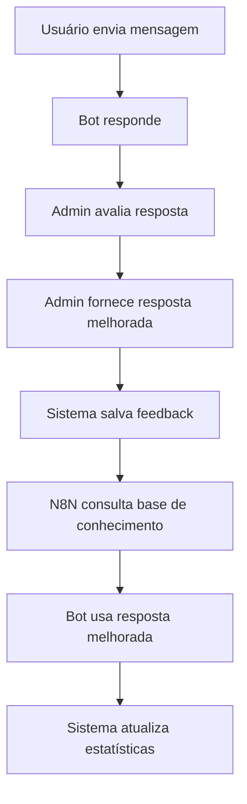

# Sistema de Treinamento do Bot

## 📚 **Visão Geral**

O sistema de treinamento permite que administradores melhorem as respostas do bot avaliando mensagens do histórico de conversas e fornecendo respostas aprimoradas. O sistema integra com workflows N8N para aplicar automaticamente as melhorias.

## 🎯 **Fluxo do Sistema**



## 🔧 **Componentes do Sistema**

### **1. Interface de Feedback**
- **Localização**: Componente `AssistantConversationsTab`
- **Funcionalidade**: Botão "Melhorar Resposta" em mensagens do bot
- **Modal**: Formulário para capturar contexto e resposta melhorada

### **2. Base de Dados**
```sql
-- Tabela principal de feedbacks
message_feedback {
  id: UUID (Primary Key)
  conversation_message_id: UUID (FK)
  bot_id: UUID (FK)
  user_message_context: TEXT -- Mensagem do usuário
  original_bot_response: TEXT -- Resposta original
  improved_response: TEXT -- Resposta melhorada
  status: ENUM -- Status do feedback
  similarity_keywords: TEXT[] -- Palavras-chave
  times_applied: INTEGER -- Contador de uso
}
```

### **3. API para N8N**
- **URL Base**: `https://[projeto].supabase.co/functions/v1/bot-feedback-api`
- **Autenticação**: Header `Authorization: Bearer [anon_key]`
- **Bot ID**: Header `x-bot-id: [bot_id]` ou query param `bot_id`

## 🚀 **Endpoints da API**

### **1. Buscar Melhor Resposta**
```http
POST /bot-feedback-api/best-response
Content-Type: application/json
x-bot-id: [BOT_ID]

{
  "userMessage": "olá",
  "threshold": 0.7
}
```

**Resposta de Sucesso:**
```json
{
  "success": true,
  "found": true,
  "improved_response": "Olá! Sou o assistente da Clínica. Como posso ajudá-lo hoje?",
  "confidence": 1.0,
  "feedback_id": "uuid"
}
```

**Sem Match:**
```json
{
  "success": true,
  "found": false,
  "message": "No matching improved response found"
}
```

### **2. Buscar Feedbacks Similares**
```http
POST /bot-feedback-api/search
Content-Type: application/json
x-bot-id: [BOT_ID]

{
  "userMessage": "agendamento consulta",
  "limit": 5
}
```

### **3. Marcar Feedback como Aplicado**
```http
POST /bot-feedback-api/apply-feedback
Content-Type: application/json
x-bot-id: [BOT_ID]

{
  "feedbackId": "uuid"
}
```

### **4. Estatísticas do Bot**
```http
GET /bot-feedback-api/stats?bot_id=[BOT_ID]
```

## 🔄 **Integração com N8N**

### **Workflow Recomendado:**

```json
{
  "nodes": [
    {
      "name": "Webhook WhatsApp",
      "type": "n8n-nodes-base.webhook"
    },
    {
      "name": "Consultar Feedback",
      "type": "n8n-nodes-base.httpRequest",
      "parameters": {
        "url": "https://[projeto].supabase.co/functions/v1/bot-feedback-api/best-response",
        "method": "POST",
        "headers": {
          "Authorization": "Bearer [anon_key]",
          "x-bot-id": "[bot_id]"
        },
        "body": {
          "userMessage": "{{ $node['Webhook WhatsApp'].json.message }}"
        }
      }
    },
    {
      "name": "Verificar Se Encontrou",
      "type": "n8n-nodes-base.if",
      "parameters": {
        "conditions": {
          "boolean": [
            {
              "value1": "{{ $node['Consultar Feedback'].json.found }}",
              "value2": true
            }
          ]
        }
      }
    },
    {
      "name": "Usar Resposta Melhorada",
      "type": "n8n-nodes-base.set",
      "parameters": {
        "values": {
          "string": [
            {
              "name": "response",
              "value": "{{ $node['Consultar Feedback'].json.improved_response }}"
            }
          ]
        }
      }
    },
    {
      "name": "Gerar Resposta Normal",
      "type": "n8n-nodes-base.openAi"
    },
    {
      "name": "Enviar WhatsApp",
      "type": "n8n-nodes-base.httpRequest"
    }
  ]
}
```

### **Configuração do Nó HTTP Request:**

```javascript
// Headers
{
  "Authorization": "Bearer {{ $env.SUPABASE_ANON_KEY }}",
  "x-bot-id": "{{ $env.BOT_ID }}",
  "Content-Type": "application/json"
}

// Body
{
  "userMessage": "{{ $json.message.text }}",
  "threshold": 0.7
}

// URL
https://[projeto].supabase.co/functions/v1/bot-feedback-api/best-response
```

## 🎨 **Interface de Administração**

### **Como Criar Feedback:**

1. **Acesse a aba "Conversas"** no painel do assistente
2. **Selecione uma conversa** da lista
3. **Encontre uma resposta do bot** que pode ser melhorada
4. **Clique no ícone de edição** (aparece ao passar o mouse)
5. **Preencha o formulário:**
   - **Mensagem do usuário**: Contexto que gerou a resposta
   - **Resposta original**: Resposta atual do bot (só leitura)
   - **Resposta melhorada**: Como o bot deveria responder
   - **Tipo de melhoria**: Categoria da melhoria
6. **Salve a melhoria**

### **Tipos de Melhoria:**
- **✨ Melhorar resposta**: Aprimorar a qualidade geral
- **📚 Adicionar contexto**: Incluir mais informações
- **🔧 Corrigir erro**: Corrigir informações incorretas
- **🎯 Melhorar tom**: Ajustar o tom de comunicação

## 📊 **Sistema de Pontuação**

### **Busca por Similaridade:**
1. **Busca exata**: Correspondência direta no texto (confidence: 1.0)
2. **Busca por palavras-chave**: Baseada em palavras em comum
3. **Threshold**: Só usa respostas com confidence >= 0.7

### **Extração de Palavras-chave:**
- **Função**: `extract_keywords_from_text()`
- **Processo**: Remove pontuação, converte para minúsculas, separa por espaços
- **Armazenamento**: Array de strings na coluna `similarity_keywords`

## 🔒 **Segurança e Permissões**

### **Row Level Security (RLS):**
```sql
-- Política para visualizar feedbacks
CREATE POLICY "Users can view message feedback for their bots" 
ON message_feedback FOR SELECT 
USING (bot_id IN (SELECT id FROM bots WHERE user_id = auth.uid()));

-- Política para criar feedbacks
CREATE POLICY "Users can create message feedback for their bots" 
ON message_feedback FOR INSERT 
WITH CHECK (bot_id IN (SELECT id FROM bots WHERE user_id = auth.uid()));
```

### **API Security:**
- **Edge Functions**: Validação de bot_id ownership
- **CORS**: Configurado para permitir chamadas do N8N
- **Service Role**: API usa service role key para operações

## 📈 **Monitoramento e Estatísticas**

### **Métricas Importantes:**
- **Total de feedbacks**: Por bot e por tipo
- **Taxa de aplicação**: `times_applied` / total_feedbacks
- **Feedbacks pendentes**: Status = 'pending'
- **Feedbacks mais usados**: Ordenados por `times_applied`

### **Endpoint de Estatísticas:**
```json
{
  "success": true,
  "stats": {
    "total": 25,
    "by_status": {
      "pending": 10,
      "applied": 12,
      "rejected": 3
    },
    "by_type": {
      "improve_response": 15,
      "add_context": 8,
      "fix_error": 2
    },
    "total_applications": 45
  }
}
```

## 🚀 **Deployment e Manutenção**

### **Edge Function Deploy:**
```bash
supabase functions deploy bot-feedback-api
```

### **Backup da Base de Conhecimento:**
```sql
-- Exportar feedbacks aplicados
SELECT * FROM message_feedback 
WHERE status = 'applied' 
ORDER BY times_applied DESC;
```

### **Limpeza Periódica:**
```sql
-- Remover feedbacks rejeitados antigos
DELETE FROM message_feedback 
WHERE status = 'rejected' 
AND created_at < NOW() - INTERVAL '90 days';
```

## 🔄 **Fluxo de Vida do Feedback**

1. **pending** → Criado pelo admin, aguardando aplicação
2. **applied** → N8N começou a usar esta melhoria
3. **rejected** → Admin decidiu não usar
4. **in_review** → Em análise para aprovação

## 🎯 **Melhores Práticas**

### **Para Admins:**
- **Seja específico**: Forneça contexto claro na mensagem do usuário
- **Seja conciso**: Respostas melhoradas devem ser diretas
- **Use palavras-chave**: Inclua termos que usuários realmente usam
- **Teste regularmente**: Verifique se as melhorias estão sendo aplicadas

### **Para Desenvolvedores N8N:**
- **Cache respostas**: Evite consultas desnecessárias à API
- **Fallback**: Sempre tenha um plano B se a API não responder
- **Log aplicações**: Registre quando usa uma resposta melhorada
- **Threshold adequado**: Configure confidence mínima (recomendado: 0.7)

## 🆘 **Troubleshooting**

### **Problema: API não retorna melhorias**
- Verifique se `bot_id` está correto
- Confirme se existem feedbacks com status 'applied'
- Teste threshold menor (0.5)

### **Problema: Feedbacks não estão sendo criados**
- Verifique permissões RLS do usuário
- Confirme se o bot pertence ao usuário atual
- Check logs do navegador para erros JavaScript

### **Problema: N8N não consegue acessar API**
- Verificar CORS headers
- Confirmar URL da Edge Function
- Testar autenticação com Postman

## 📞 **Suporte**

Para dúvidas técnicas:
1. Consulte os logs da Edge Function
2. Verifique a documentação da API
3. Teste endpoints com curl/Postman
4. Entre em contato com o suporte técnico 